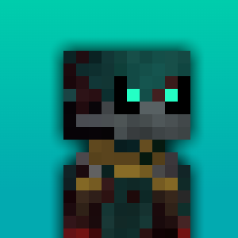

#  BTTLYPFP

BTTLYPFP is a fork of MCPFP, the main feature is that it redirects all the calls to the Battly launcher API instead of Mojang/Microsoft's
api or any other mcskin API.

> **Please keep in mind the site is being hosted on a free Render account, Render hosting works by "Sleeping" the site which means sometimes it can cost sometime to load it (the process lf "waking up" the site)**

#  MCPFP

MCPFP is a site to generate Minecraft profile pictures with ease.\
No more paying fiverr artists!

[MCPFP by Maurits Wilke](https://github.com/MauritsWilke/mcpfp)


# 💻 Running locally
To run this repository locally, clone the repository from the command line.
```bash
 $ git clone https://github.com/nyzonix/mcpfp-fork.git
```
In the same directory as the cloned repository, run the following commands to set up the project.
```bash
 $ npm install
```
To then start the local site
```
 $ npm run dev
```

# 🗺 Roadmap
 - [ ] ↔ Flip the profile picture
 - [ ] 🎨 Custom gradients
 - [ ] 🎩 Cosmetics
 - [ ] 💈 Hair layer toggle
 - [ ] 📷 Upload custom background
 - [ ] 💡 Improve light mode colour scheme
 - [ ] 📟 Tablet support
 - [x] 🗄 Move the rendering to back-end (mainly for better meta tags)
 - [x] 📱 Mobile support
